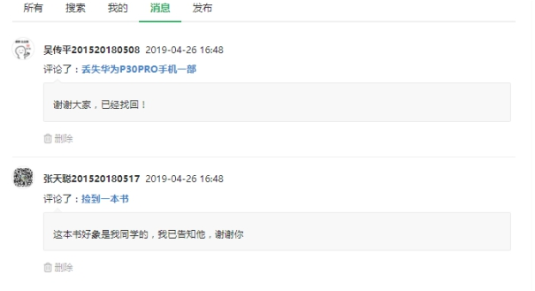
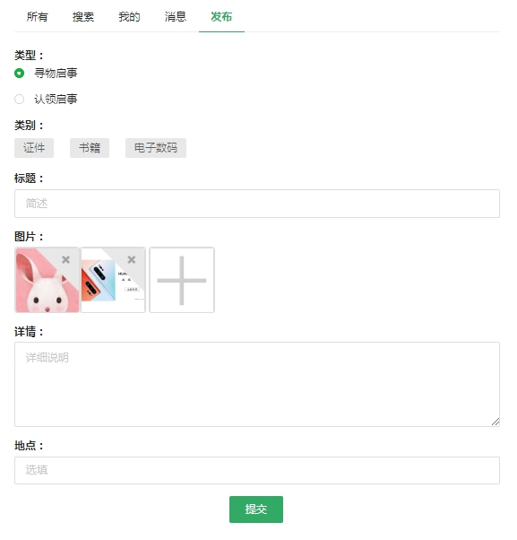
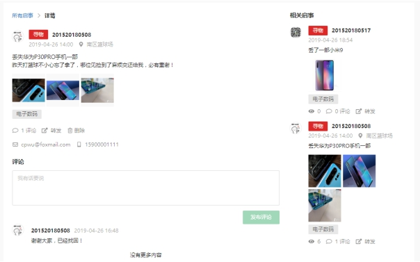
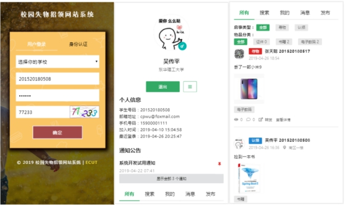
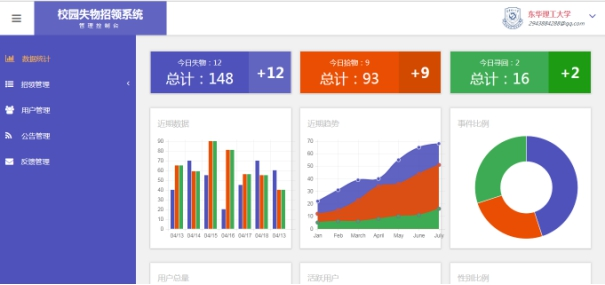
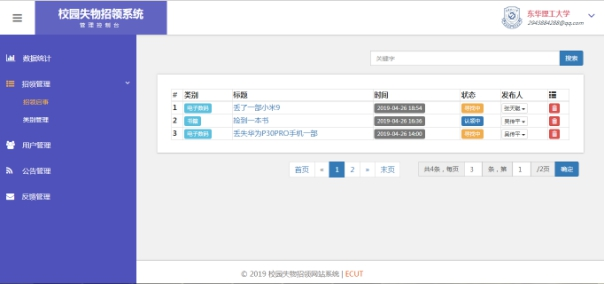
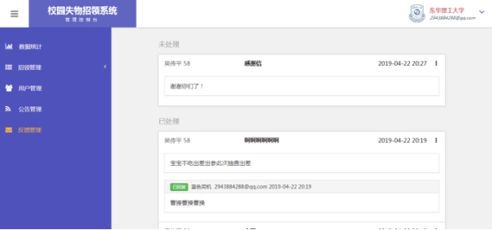

# 校园失物招领系统 - 后台

* 开发工具：IntelliJ IDEA

* 语言：JAVA (`1.8`)

* 框架：Spring Boot (`2.1.3.RELEASE`) + Spring Data JPA

* 数据库： MySQL (`5.7`)

》[前端地址](https://github.com/BlueDriver/lost-found-UI)《

## 项目特点

* Spring Boot + Maven多模块项目
* 拦截器的使用
* 统一异常处理
* controller层参数校验
* 跨域访问
* 邮件发送（结合JetBrick模板引擎）
* 常用配置
* 随机验证码生成

## 主要功能

普通用户：

* 认证登录

* 修改头像、密码、手机、反馈

* 发布、搜索、查看招领信息

* 认领、评论物品

> 注意：用户的认证分使用的`Jsoup`模拟登录教务系统实现的，本项目当前仅针对[东华理工大学](http://www.ecit.edu.cn/)学生进行，其他学校请自行探索或改用注册方式等。

管理员：

* 数据统计（未实现）
* 招领信息管理、物品类别管理
* 用户管理
* 公告管理
* 反馈管理

## 说明

1. 运行项目前请先**初始化数据库**，脚本见`sql.md`文件，用户邮箱建议改成自己的有效邮箱，脚本中的为示例。

预设用户：

| 学校         | 类型     | 用户名       | 密码   |
| ------------ | -------- | ------------ | ------ |
| 东华理工大学 | 普通用户 | 201520180508 | 123456 |
| 东华理工大学 | 管理员   | admin@qq.com | 123456 |

2. 部分接口定义见`api.md`

## 运行截图

### 普通用户
认证登录：

系统主页：

我的消息：

发布信息：

物品详情：

移动端适配：

### 管理员
数据统计：

招领信息管理：

反馈管理：

》[前端地址](https://github.com/BlueDriver/lost-found-UI)《